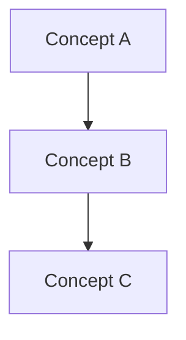
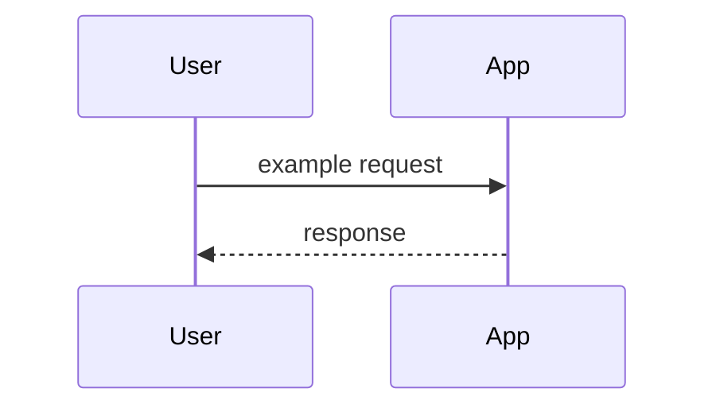

# Codebase guide: <project name>

**Session**: <session-id>
**Generated**: /kon:understand-codebase

> After build, open `understand-guide.html`: click a concept heading, term chip, or mermaid node to see details in the side panel.

## Key concepts

Glossary of domain and technical terms used in this codebase.
**Use the same names in mermaid node labels** so diagram clicks resolve to these entries.

### <Concept name>

| | |
|---|---|
| **Definition** | <precise meaning in this repo> |
| **Usage** | <where/how it appears in practice> |
| **Source** | [`path/to/file.py:42`](path/to/file.py:42) — clickable after build |

**Reference code** — copy the real implementation from the repo (≤ 30 lines):

```42:58:path/to/file.py
<paste actual source here — must match path:line above>
```

*(Repeat for each concept — aim for 6–15 entries.)*

## Concept map



## Architecture

| | |
|---|---|
| **Topology** | `single-node` \| `distributed` \| `hybrid` |
| **Summary** | <one paragraph: what runs where> |

### Components

| Component | Role | Key paths |
|-----------|------|-----------|
| | | |

### Data flow



### Boundaries

- **In scope**: …
- **External systems**: …
- **Persistence**: …

### Operational notes

- How to run locally
- Config / env vars
- Extension points

## FAQ

Common questions a new contributor would ask — **concepts and architecture only** (implementation how-tos belong in flashcards/quiz, not here).

*(Aim for 5–10 Q&A pairs.)*

### Q: <question a newcomer would ask>

<Answer in 2–4 sentences.>

**Source:** [`path/to/file.py:10`](path/to/file.py:10) (optional snippet below)

```10:18:path/to/file.py
<optional supporting code>
```

### Q: <another question>

<Answer.>

*Good FAQ topics: naming that confuses people, "why is X separate from Y?", startup order, where state lives, what is *not* in this repo, single-node vs distributed implications.*

## Sources

Based on `understand-explore.md` from this session. Evidence paths cited inline.
