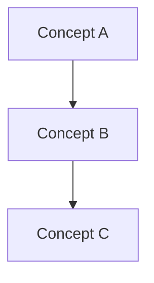
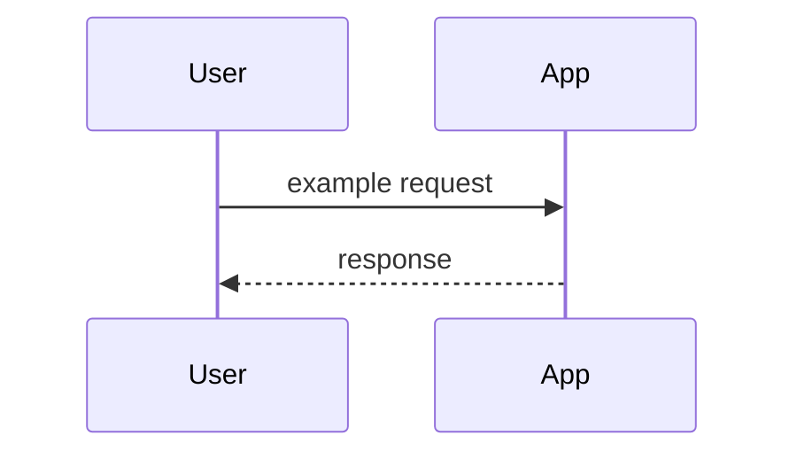

# Codebase guide: <project name>

**Session**: <session-id>
**Generated**: /kon:understand-codebase

## Key concepts

Glossary of domain and technical terms used in this codebase.

### <Concept name>

| | |
|---|---|
| **Definition** | <precise meaning in this repo> |
| **Usage** | <where/how it appears in practice> |
| **See also** | `path:line`, related terms |

*(Repeat for each concept — aim for 6–15 entries.)*

## Concept map

## Architecture

| | |
|---|---|
| **Topology** | `single-node` \| `distributed` \| `hybrid` |
| **Summary** | <one paragraph: what runs where> |

### Components

| Component | Role | Key paths |
|-----------|------|-----------|
| | | |

### Data flow

### Boundaries

- **In scope**: …
- **External systems**: …
- **Persistence**: …

### Operational notes

- How to run locally
- Config / env vars
- Extension points

## Sources

Based on `understand-explore.md` from this session. Evidence paths cited inline.
